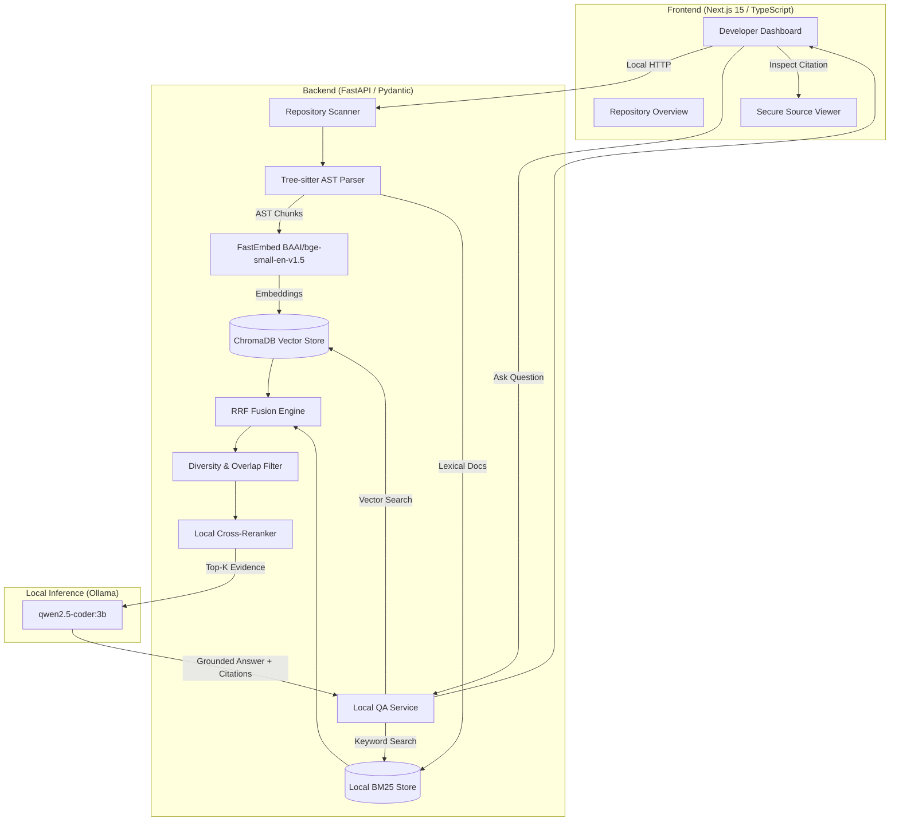

# Codebase QA Assistant

A local-first developer tool for exploring, querying, and understanding Python codebases through grounded retrieval-augmented generation (RAG). Built with Next.js, FastAPI, Tree-sitter, FastEmbed, ChromaDB, BM25, and local Ollama inference (`qwen2.5-coder:3b`).

---

## 1. Project Overview & Problem Statement

### Problem Statement
Software engineers constantly navigate unfamiliar repositories, trace cross-component interactions, and investigate complex implementation details. Existing AI code tools typically upload user source code to third-party cloud LLMs and hosted vector databases, creating major intellectual property, privacy, and compliance risks. Furthermore, conventional RAG systems rely on naive line-based text chunking that cuts across functions and classes, dilutes code semantics, and produces hallucinatory answers with incorrect line references.

### Solution
**Codebase QA Assistant** is an offline-capable, local-first code QA system. It parses repositories using Tree-sitter AST awareness, generates dense vector embeddings via local ONNX models, indexes lexical tokens with BM25, fuses evidence through Reciprocal Rank Fusion (RRF), filters redundant overlapping scopes, optionally reranks candidates, and feeds top-$k$ evidence to a local Ollama model. Repository files, embeddings, indexes, and generation remain strictly on the developer's workstation.

---

## 2. Key Features

- **AST-Aware Code Chunking**: Tree-sitter Python parser extracts semantic functions, classes, and methods, while grouping module preambles to eliminate single-line import pollution.
- **Hybrid Retrieval Pipeline**: Combines dense vector retrieval (FastEmbed + ChromaDB) with sparse lexical retrieval (BM25) fused via Reciprocal Rank Fusion ($k=60$).
- **Diversity & Overlap Suppression**: Filters parent-child AST chunk collisions, ensuring retrieval slots contain diverse, non-redundant evidence.
- **Local Cross-Encoder Reranking**: Re-scores candidates by measuring identifier alignment, query term coverage, and rank normalization without heavy cloud dependencies.
- **Local LLM Grounding**: Runs `qwen2.5-coder:3b` via Ollama with strict system prompts that require direct attribution to retrieved code chunks.
- **Repository Overview Intelligence**: Exposes deep repository statistics (`GET /api/repositories/{id}/overview`) including total files, lines of code, AST chunks, classes, functions, and methods.
- **Secure Source Navigation**: Interactive source viewer (`GET /api/repositories/{id}/source`) with strict canonical path traversal and symlink validation.
- **Offline / Local AI Guarantee**: Transparent status indicator verifying that all indexing, vector storage, and inference execute locally.
- **Reproducible Evaluation System**: Internal benchmark suite (`scripts/evaluate_rag.py`) testing 14 questions across 8 categories with automated report generation.

---

## 3. Architecture



---

## 4. Technology Stack

| Layer | Technologies |
| :--- | :--- |
| **Frontend** | Next.js 15 (App Router), TypeScript, Tailwind CSS |
| **Backend** | Python 3.11+, FastAPI, Pydantic v2, Uvicorn |
| **Parsing & Chunking** | `tree-sitter`, `tree-sitter-python` |
| **Dense Embeddings** | `fastembed` (`BAAI/bge-small-en-v1.5` via ONNX Runtime) |
| **Vector Storage** | `chromadb` (Persistent local storage) |
| **Lexical Search** | Local BM25 engine with identifier and sub-token splitting |
| **Inference Engine** | Local Ollama running `qwen2.5-coder:3b` |
| **Testing** | `pytest`, `httpx`, Next.js production build |

---

## 5. The RAG Pipeline

```text
Repository Path
  ↓
Tree-sitter AST Parsing
  ↓
AST-Aware Chunks (Classes, Functions, Methods, Grouped Preambles)
  ↓
Local FastEmbed Embeddings (BAAI/bge-small-en-v1.5)
  ↓
ChromaDB Semantic Retrieval + Local BM25 Lexical Retrieval
  ↓
Reciprocal Rank Fusion (RRF, k=60)
  ↓
Diversity & Overlap Filtering (suppresses parent/child duplicate chunks)
  ↓
Optional Local Cross-Reranking (Identifier match + token coverage)
  ↓
Top-K Evidence Assembly
  ↓
Ollama + qwen2.5-coder:3b
  ↓
Grounded Answer + Exact Source Citations
```

### Key Pipeline Stages
1. **Tree-sitter AST Chunking**: Rather than splitting files every $N$ lines, the AST parser traverses the syntax tree, identifying function and class boundaries. Multi-line import sequences are grouped into single `module_preamble` chunks, preventing single-line import pollution in retrieval.
2. **Hybrid RRF Fusion**: Scores candidates using $RRF(d) = \sum_{m \in M} \frac{1}{k + r_m(d)}$ with $k=60$. Combines semantic conceptual matching with exact identifier precision.
3. **Diversity Filtering**: Inspects chunk start/end lines within the same file and suppresses overlapping children if an enclosing scope is already selected (or vice versa).
4. **Local Reranking**: Evaluates query term alignment across chunk symbols, parent symbols, file stem names, and body text to prioritize exact implementations.
5. **Grounded Generation**: Feeds formatted snippets to Ollama with strict instruction that answers must be derived solely from retrieved evidence, citing `[file_path:start-end]`.

---

## 6. Repository Overview & Source Navigation

### Repository Overview API
- **Endpoint**: `GET /api/repositories/{id}/overview`
- **Output**: Total files, total lines of code, AST chunks, classes, functions, methods, embedding model, LLM model, and index timestamp.
- **Performance**: Derived directly from the AST chunks without re-scanning or external database calls.

### Secure Source Navigation API
- **Endpoint**: `GET /api/repositories/{id}/source?file_path=...&start_line=...&end_line=...`
- **Security Boundaries**:
  - Rejects null bytes and path traversal patterns (`..`).
  - Resolves canonical paths and enforces `target.relative_to(canonical_repo_root)`.
  - Verifies symlinks do not point outside the repository directory.
  - Constrains line ranges safely within total file line bounds.

---

## 7. Evaluation & Benchmark Results

We conducted an internal, reproducible benchmark over the codebase using `data/evaluation/questions.json` and `scripts/evaluate_rag.py`.

> [!NOTE]
> This is an internal project evaluation conducted on this repository. No claims of SWE-bench or HumanEval-RAG are made.

### Summary Metrics Across 14 Questions

| Mode | File Recall | Symbol Recall | Evidence Recall | Grounded Answer Rate |
| :--- | :---: | :---: | :---: | :---: |
| **Semantic only (ChromaDB + FastEmbed)** | 92.9% | 100.0% | 92.9% | 92.9% |
| **BM25 only (Lexical search)** | 100.0% | 100.0% | 100.0% | 100.0% |
| **Hybrid RRF (Vector + BM25, $k=60$)** | 100.0% | 100.0% | 100.0% | 100.0% |
| **Hybrid + Reranking (Local Cross-Encoder)** | 100.0% | 100.0% | 100.0% | 100.0% |

- Full question-by-question matrix and failure mode analysis: see [`docs/evaluation.md`](file:///c:/Users/autho/OneDrive%20-%20WOXSEN%20UNIVERSITY/Documents/ChatGPT/Codebase%20QA%20Assistant/docs/evaluation.md).

---

## 8. Privacy & Local Execution Guarantees

- **No Cloud AI APIs**: Never transmits code, embeddings, or queries to OpenAI, Anthropic, or external providers.
- **No Hosted Databases**: ChromaDB and BM25 store index artifacts entirely under `backend/data/`.
- **Loopback Ollama**: Rejects non-loopback Ollama base URLs to ensure inference stays on `127.0.0.1`.
- **Honest Offline Stance**: Initial installation (`pip`, `pnpm`) and model downloads (`ollama pull`, FastEmbed ONNX weights) require standard network access during setup. Once cached, repository indexing, retrieval, and generation run entirely offline.

---

## 9. Installation & Setup

### Prerequisites
- Node.js 20.9+ and pnpm (or npm)
- Python 3.11+
- [Ollama](https://ollama.com/download) installed locally

### Step 1: Ollama Setup
Pull the default local coding model:
```powershell
ollama pull qwen2.5-coder:3b
```

### Step 2: Backend Setup
```powershell
cd backend
python -m venv .venv
.\.venv\Scripts\Activate.ps1
python -m pip install -r requirements.txt
python -m uvicorn app.main:app --reload --app-dir .
```
Backend will be available at `http://localhost:8000`.

### Step 3: Frontend Setup
In a new terminal:
```powershell
cd frontend
pnpm install --frozen-lockfile
Copy-Item .env.example .env.local
pnpm dev
```
Frontend will be available at `http://localhost:3000`.

---

## 10. Running Tests & Evaluation

### Run Backend Tests (53 tests)
```powershell
cd backend
python -m pytest tests
```

### Run Frontend Production Build
```powershell
cd frontend
pnpm run build
```

### Run Internal Benchmark Suite
```powershell
python scripts/evaluate_rag.py --with-llm
```

### Run Real End-to-End Smoke Test
```powershell
python scripts/test_e2e_real.py
```

---

## 11. Example Questions

1. **Exact Identifier**: `"Where is rrf_k configured in settings and what is its default value?"`
2. **Function Explanation**: `"Explain what reciprocal_rank_fusion does in services/hybrid.py"`
3. **Class Explanation**: `"What is LocalReranker in services/reranker.py and what scoring weights does it use?"`
4. **Architecture / Interaction**: `"How does LocalQAService interact with ChromaDB and BM25 during retrieval?"`
5. **Implementation & Security**: `"How does get_repository_source_snippet prevent directory traversal and symlink attacks?"`

---

## 12. Project Limitations

1. **Language Scope**: Parser and AST chunking currently support Python only.
2. **Single-Turn QA**: Conversations currently operate per question without persistent multi-turn conversational memory.
3. **Single Repository Focus**: Active chat sessions target one indexed repository at a time.
4. **Initial Download Requirement**: Setup requires downloading the 1.9 GB Ollama model and 67 MB FastEmbed weights.
